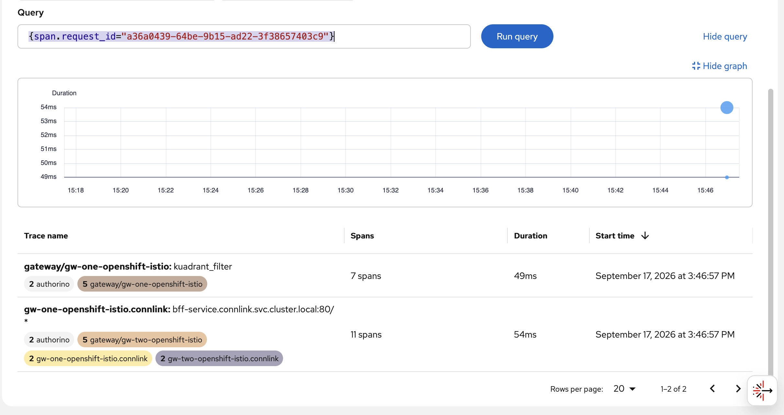

# Traces

Distributed tracing para Connectivity Link (Kuadrant) en OpenShift. Hay dos bundles según el tipo de Gateway:

| Bundle | Gateway | Istio tracing | Uso |
|--------|---------|---------------|-----|
| **[trace-kuadrant/](trace-kuadrant/README.md)** | `openshift-default` | No | Solo spans Kuadrant (wasm-shim, Authorino, Limitador) |
| **[trace-istio-kuadrant/](trace-istio-kuadrant/README.md)** | `openshift-istio` | Sí (`Istio` CR + `Telemetry`) | Kuadrant + spans HTTP de Envoy en el mismo collector |

Ambos comparten: Tempo multitenant, OpenTelemetry Collector, UIPlugin, CR Kuadrant (`tracing` + `x-request-id`), EnvoyFilter `preserve-request-id`.

```bash
# Solo Kuadrant
cd traces/trace-kuadrant && ./apply-all.sh

# Istio + Kuadrant (incluye subscription OpenShift Service Mesh 3)
cd traces/trace-istio-kuadrant && ./apply-all.sh
```

## Dos traces con el mismo `request_id` (comportamiento esperado)

En el bundle **Istio + Kuadrant**, una misma petición puede aparecer en Tempo como **dos traces distintos** si filtras solo por `span.request_id` (por ejemplo el `x-request-id` del cliente). Eso es **normal**, no indica un fallo de configuración.



En la captura se ven dos grafos separados que comparten el identificador de request:

| Trace | Origen típico | Qué muestra |
|-------|----------------|-------------|
| **1** | Envoy / Istio (gateway `openshift-istio`) | Span HTTP del proxy (`gw-two-openshift-istio…`), rutas upstream, tags de mesh |
| **2** | Kuadrant (wasm-shim → Authorino / Limitador) | Auth, rate limit, llamadas gRPC internas |

Ambos envían OTLP al **mismo** collector y Kuadrant etiqueta spans con `request_id` a partir de `x-request-id` (`httpHeaderIdentifier` en el CR). Por eso TraceQL como `{ span.request_id = "…" }` **encuentra spans en los dos traces**, pero **no los une en un solo `trace_id`**.

### Por qué pasa

1. **Dos productores de spans** en el edge: el tracer de Envoy (Istio `Telemetry`) y el tracer de wasm-shim (config Kuadrant).
2. **Limitación WASM en Envoy:** si el trace lo **inicia Envoy** (cliente sin contexto W3C), el filtro WASM **no recibe** el `traceparent` del span del proxy; los headers de trace suelen inyectarse más tarde en la cadena HTTP. Kuadrant documenta este escenario; ver también [Kuadrant – Tracing](https://docs.kuadrant.io/latest/kuadrant-operator/doc/observability/tracing/).

Con **solo** el bundle [trace-kuadrant/](trace-kuadrant/README.md) (gateway `openshift-default`, sin Istio tracing) suele haber **un solo árbol** de spans Kuadrant por request.

### Cuándo todo queda en **un solo trace** integrado

| Escenario | Resultado |
|-----------|-----------|
| Cliente (o BFF) envía **`traceparent`** W3C (y opcionalmente `tracestate` / `baggage`) **antes** del gateway | wasm-shim puede crear spans **hijos** de ese trace; Istio/Envoy también participa en la misma cadena W3C → **un `trace_id`** en Tempo |
| Solo tracing Kuadrant en el edge (bundle **trace-kuadrant**, sin `Telemetry` Istio) | Un trace centrado en wasm-shim / Authorino; **sin** span HTTP de Envoy |
| Workloads en mesh con sidecar + `Telemetry` | Más spans **dentro del mismo trace** hacia backends inyectados; el gateway sigue siendo el punto crítico para unir con Kuadrant |

Ejemplo de prueba con trace unificado desde el cliente:

```bash
TRACE_ID=$(openssl rand -hex 16)
SPAN_ID=$(openssl rand -hex 8)
REQ_ID="mi-request-$(date +%s)"

curl -H "x-request-id: ${REQ_ID}" \
     -H "traceparent: 00-${TRACE_ID}-${SPAN_ID}-01" \
     -H "Host: api.apps.sno.home" \
     http://<gateway>/
```

Buscar en Tempo por **`trace_id`** (el valor hex de `TRACE_ID`), no solo por `span.request_id`.

Más detalle en [trace-istio-kuadrant/README.md](trace-istio-kuadrant/README.md).

## TraceQL útil

```traceql
{ span.request_id = "test-123" }
{ resource.k8s.namespace.name = "connlink" }
```
